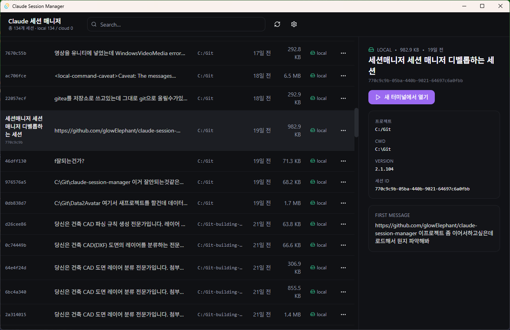

# Claude Session Manager

A desktop app for managing [Claude Code](https://docs.anthropic.com/en/docs/claude-code) sessions — list, name, resume, and sync across devices.

Built with **Tauri 2 + React + TypeScript + Tailwind + shadcn/ui**. Modern dark theme, works on Windows, macOS, Linux.



## Features

- **Session list** — All sessions in `~/.claude/projects/` shown with name, description, project, last activity, size, storage type
- **Search & filter** — Instant search across name / description / project / first message
- **Quick resume** — Double-click a row or hit the action menu to open the session in a new terminal (Git Bash on Windows, Terminal on macOS, configurable on Linux)
- **Rename / describe** — Custom names and descriptions persist to `~/.claude-sessions/config.json`
- **Auto-summary** — 1-line summaries via Claude Haiku (cached — generated only once)
- **Cloud sync** — Point at any cloud-synced folder (Google Drive / OneDrive / Dropbox / iCloud / …). Upload + checkout/checkin pattern keeps the source of truth in sync
- **i18n** — English and Korean, auto-detected, overridable in Settings (live switch — no restart)

## Install

### Pre-built installer (recommended for end users)

Grab the latest installer from [Releases](https://github.com/glowElephant/claude-session-manager/releases):
- Windows: `.msi` or `-setup.exe`
- macOS: `.dmg`
- Linux: `.AppImage` / `.deb`

After install, launch from the Start Menu / Applications. **You still need [Claude Code](https://docs.anthropic.com/en/docs/claude-code) on `PATH`** for the "Open in new terminal" action to work.

### From source

```bash
git clone https://github.com/glowElephant/claude-session-manager.git
cd claude-session-manager
pnpm install

# Dev mode (hot reload, opens a window)
pnpm tauri dev

# Production build (OS-native installer)
pnpm tauri build
```

Installers land in `src-tauri/target/release/bundle/`.

#### Build prerequisites

- **Node.js 18+** and **pnpm**
- **Rust toolchain** (`rustup` — install via <https://rustup.rs>)
- **Tauri 2** platform prerequisites (WebView2 on Windows — Win11 has it; Xcode CLT on macOS; webkit2gtk on Linux) — see <https://v2.tauri.app/start/prerequisites/>

#### Runtime prerequisites

- [Claude Code](https://docs.anthropic.com/en/docs/claude-code) on `PATH` — required to actually resume sessions
- *(optional)* Anthropic API key in Settings — enables the auto-summary feature

## Configuration

Stored at `~/.claude-sessions/config.json`:

```json
{
  "sessions": {
    "abc123-uuid": {
      "name": "my-feature",
      "description": "Working on the new auth flow",
      "autoSummary": "Refactoring auth middleware for compliance",
      "storageType": "local",
      "updatedAt": "2026-04-15T..."
    }
  },
  "settings": {
    "locale": "en",
    "cloudPath": "G:/My Drive/Claude Sessions",
    "anthropicApiKey": "sk-ant-..."
  }
}
```

The API key is stored locally only; nothing is transmitted except the direct call to `api.anthropic.com` when you request a summary.

### Environment variables

| Variable | Purpose |
|---|---|
| `CLAUDE_SESSION_HOME` | Override the home directory used to resolve `~/.claude/projects/` and `~/.claude-sessions/`. Used mainly by the test suite and CLI harness for isolated runs. |
| `GIT_BASH` | Windows: explicit path to `git-bash.exe`. If unset, the app searches `%ProgramFiles%\Git`, `%ProgramFiles(x86)%\Git`, `%ProgramW6432%\Git`, `%LOCALAPPDATA%\Git`, and falls back to `cmd.exe`. |
| `ANTHROPIC_API_KEY` | Used as a fallback for the auto-summary feature when the key is not set in Settings. |

## Cloud sync — how it works

1. Open **Settings → Cloud folder → Browse** and pick any cloud-synced local folder (Google Drive desktop, OneDrive, Dropbox, etc.). A `Claude Sessions` subfolder is created there.
2. From the action menu, **Upload to cloud** copies the session JSONL + a `.meta.json` sidecar into that folder. Your cloud app handles syncing.
3. On another machine, install this app and point Settings at the same cloud folder. Uploaded sessions show up with the `cloud` badge.
4. **Resume** on a cloud session auto-checks it out to local `~/.claude/projects/`, runs `claude --resume`, and you can check back in when done.

No vendor-specific APIs, no OAuth. Works with any sync provider that mounts locally.

## Architecture

```
src-tauri/
├── src/
│   ├── lib.rs              # Tauri command handlers (IPC entry points)
│   ├── main.rs             # GUI binary entry
│   ├── bin/cli.rs          # Headless CLI harness (session-cli)
│   ├── scanner.rs          # ~/.claude/projects/ scanning + JSONL parsing
│   ├── config.rs           # ~/.claude-sessions/config.json read/write
│   ├── cloud.rs            # Cloud folder upload / checkout / checkin
│   ├── resume.rs           # Build platform-specific terminal command
│   ├── summary.rs          # Anthropic API call for auto-summary
│   └── types.rs            # Session / Config / Settings structs
├── tests/integration.rs    # 15 integration tests against tempfile-isolated home
└── Cargo.toml              # Two binaries: claude-session-manager (GUI) + session-cli

src/
├── App.tsx                 # Top-level layout
├── components/
│   ├── SessionTable.tsx    # Virtualized list with search/filter
│   ├── SessionDetail.tsx   # Right-side detail panel
│   ├── EditDialog.tsx      # Rename / edit description
│   └── SettingsDialog.tsx  # Language / cloud folder / API key
├── lib/ipc.ts              # Typed wrappers around Tauri invoke
└── i18n/{en,ko}.json       # Translations
```

The frontend calls the Rust backend over Tauri's IPC bridge. Each `#[tauri::command]` in `lib.rs` corresponds to one entry in `src/lib/ipc.ts`.

## Development

### Run tests

```bash
cd src-tauri
cargo test --tests
```

15 integration tests cover scanner JSONL parsing, config persistence, settings updates, and resume command construction across Windows / macOS / Linux. Tests use `CLAUDE_SESSION_HOME` to point at a `tempfile`-managed temp dir, so they never touch your real `~/.claude/`.

### Headless CLI harness

The `session-cli` binary exercises every backend operation without launching the GUI — useful for debugging, scripting, or smoke-testing in CI:

```bash
cd src-tauri
cargo build --bin session-cli

# List all sessions as JSON
./target/debug/session-cli list

# Print resolved paths
./target/debug/session-cli paths

# Persist a name/description
./target/debug/session-cli set-name <session-id> "my-feature"
./target/debug/session-cli set-desc <session-id> "auth refactor"
./target/debug/session-cli delete-meta <session-id>

# Inspect what `Open in new terminal` would run, without spawning anything
./target/debug/session-cli resume-plan <session-id> [cwd]

# Read first N user messages from a JSONL file
./target/debug/session-cli messages <file-path> 5

# Print current config.json contents
./target/debug/session-cli get-config
```

Use it against an isolated home to avoid touching real config:

```bash
CLAUDE_SESSION_HOME=/tmp/scratch ./target/debug/session-cli list
```

### Contributing

1. Fork → branch → make changes
2. `cargo test --tests` and `pnpm tauri dev` to verify
3. Submit a PR

## License

MIT — see [LICENSE](./LICENSE).
